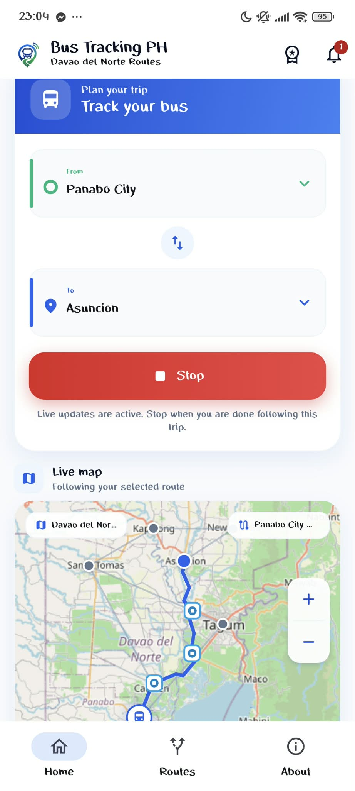
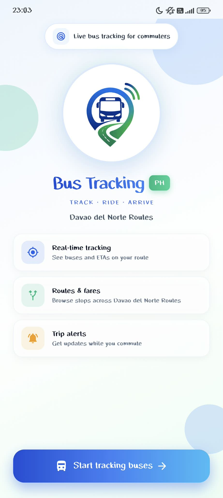

# 🚍 Smart Bus Tracker

A full-stack real-time bus tracking and management system built with **Flutter**, **React**, and **Firebase**.

Smart Bus Tracker helps improve public transportation efficiency by allowing commuters to track buses in real time while providing administrators with powerful tools to manage routes, schedules, and system operations through a centralized web dashboard.

---

## ✨ Overview

The system connects commuters, administrators, and live transit data into one unified platform.

### Key Benefits

* 📱 Real-time commuter bus tracking
* 💻 Centralized admin management dashboard
* 🔥 Firebase-powered real-time synchronization
* 🔐 Secure role-based access control
* 🌍 Scalable cloud-based architecture

---

## 🧱 Project Structure

```text
smart_bus_tracker/
│
├── mobile_app/      # Flutter commuter application
├── admin_web/       # React-based admin dashboard
└── firebase/        # Firebase configuration, rules, and functions
```

---

## 📱 Commuter App (Flutter)

A mobile application that enables commuters to monitor buses and routes in real time.

### 🚀 Features

* 🚌 Live bus location tracking
* 📍 Route and stop information
* ⏱️ Estimated Time of Arrival (ETA)
* 🔥 Real-time Firebase updates
* 📱 Responsive and user-friendly interface

### ▶️ Run the Mobile App

```bash
cd mobile_app
flutter pub get
flutter run
```

---

## 💻 Admin Dashboard (React)

A web-based control panel for managing buses, routes, schedules, and users.

### 🚀 Features

* 🔐 Secure authentication system
* 👑 Role-based access control

  * Super Admin
  * Sub Admin
* 🧭 Route and schedule management
* 🚌 Bus management
* 📊 Real-time system monitoring
* ⚡ Instant Firestore synchronization

### ▶️ Run the Dashboard

```bash
cd admin_web
npm install
npm run dev
```

### 🔑 User Access

Users are automatically redirected to the appropriate dashboard based on their assigned Firestore role after login.

---

## 🔥 Firebase Backend

Firebase serves as the backend infrastructure for authentication, data storage, and real-time synchronization.

### Included Services

* Firebase Authentication
* Cloud Firestore Database
* Cloud Functions
* Firebase Hosting

### Setup Guide

Refer to:

```text
FIREBASE_SETUP.md
```

---

## 🏗 System Architecture

```text
📱 Flutter Mobile App
          │
          ▼
🔥 Firebase (Firestore + Authentication)
          │
          ▼
💻 React Admin Dashboard
```

---

## 🎯 Purpose

This project demonstrates a complete transportation management solution that combines mobile development, web development, and cloud services.

### Objectives

* 📱 Deliver a mobile-first commuter experience
* 💻 Provide centralized administrative control
* 🔥 Enable real-time data synchronization
* 🔐 Implement secure role-based access
* 🌍 Build a scalable full-stack architecture

---

## ⚡ Technology Stack

### Frontend

* Flutter (Dart)
* React
* HTML
* Tailwind
* JavaScript

### Backend

* Firebase Authentication
* Cloud Firestore
* Firebase Cloud Functions
* Node.js

### Development Tools

* Git & GitHub
* Visual Studio Code
* Android Studio

---

## 📋 Prerequisites

Before running the project, ensure you have installed:

* Flutter SDK
* Node.js and npm
* Firebase Project
* Android Studio / Android Emulator
* Visual Studio Code

---

## 🚀 Future Improvements

* 🗺️ Advanced live GPS map tracking
* 🔔 Push notifications for arrivals and delays
* 🤖 AI-based route optimization
* 👨‍✈️ Driver companion mobile application
* 💳 Online ticketing and payment integration
* 📈 Transit analytics and reporting

---

## 📸 Screenshots

### Mobile Application

<p align="center">
  
  
</p>
---
## ⚠️ Project Note

This project currently demonstrates a **simulated bus movement system** for testing and presentation purposes.

The bus locations displayed within the application are generated through simulation and do not represent real-world GPS data from actual buses. The simulation is used to showcase the system's real-time tracking capabilities, route visualization, ETA functionality, and Firebase-based data synchronization.

Future versions may integrate live GPS devices or mobile-based location tracking to provide real-world bus monitoring.

